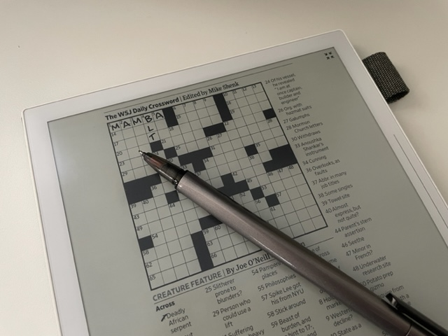
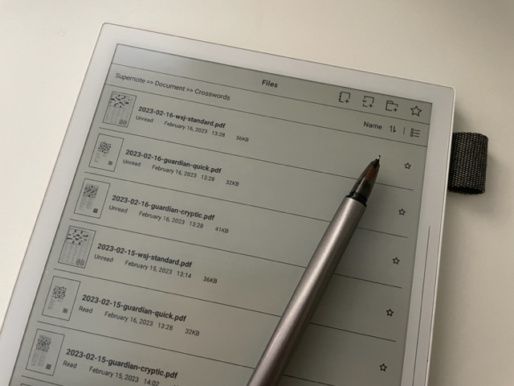

# Supernote Crosswords

An automated utility to upload daily crosswords to your Supernote Cloud

## What does it do?

Currently, the script (running every 6 hours by **GitHub Actions**) will deliver the following puzzles:

- The Guardian
  - [Mon-Sat] Quick crossword
  - [Mon-Sat] Cryptic crossword
- Wall Street Journal
  - [Mon-Sat] Standard crossword[^1]
  - [Sat] Variety crossword
  - [Sat] Number puzzles

## How do I use it?

1. On your Supernote, create a folder under `Document` called `Crosswords`, and sync with Supernote Cloud
2. Fork this repository to get your own copy
3. In your fork's settings, go to `Security > Secrets and variables > Actions` add two **Repository secrets** to hold your Supernote Cloud login credentials:
   - `SUPERNOTE_CLOUD_EMAIL`
   - `SUPERNOTE_CLOUD_PASSWORD`
4. Wait for the script to run on schedule, or manually trigger it on the `Actions` tab
5. On your Supernote, perform a sync with Supernote Cloud, and check your `Document/Crosswords` folder.

Puzzles are named with the following format (making them nicely sortable):

`{yyyy}-{mm}-{dd}-{provider}-{kind}.pdf`

## How does this talk to Supernote Cloud? I thought there's no API

I wrote a [library](https://github.com/colingourlay/supernote-cloud-api) that can communicate with Cloud, based on inspection of how the web UI communicates with the Supernote back-end and AWS S3 (where uploaded documents are actually stored).

If it's a useful enough library, I may extend it for other usage (downloads, folder creation, etc.), but for now it only implements the API calls needed to facilitate authentication, directory traversal/listing and uploads.

## Thanks

Ade Bateman, who also had a stab at creating an [unofficial Cloud API](https://github.com/adrianba/supernote-cloud-api) for the web using the same method I did.

[^1]: Sometimes the script can't predict the name of the daily WSJ crossword, so it won't be delivered that day
